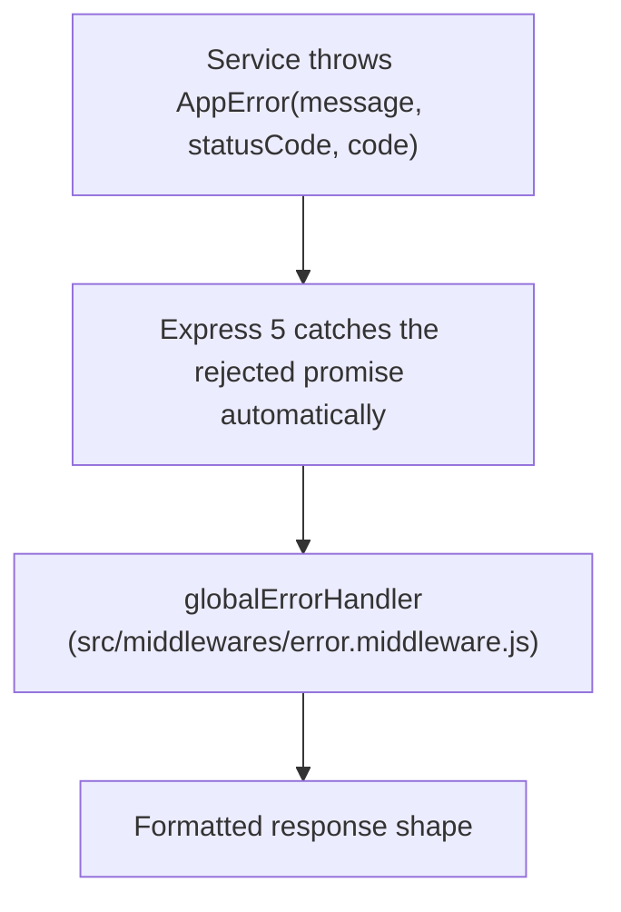

# Error Codes

> **Status:** As-of 2026-04-25. This document is a glossary that drifts as the codebase evolves — refresh it when adding or removing codes from `src/constants/appErrorCode.js`.

The TroveCloud backend returns structured errors with stable, machine-readable codes. The frontend consumes these codes to drive UI behavior (which form to redirect to, which message to show, when to retry). This document is the contract: the source of truth for what each code means and where it's thrown.

---

## 🏗️ How Errors Flow



Response shape:

```json
{
    "status": "fail | error",
    "error": {
        "code": "PROVIDER_MISMATCH",
        "message": "Human-readable explanation"
    }
}
```

- `status` is `"fail"` for 4xx (client error) and `"error"` for 5xx (server error).
- `code` is one of the values listed in this document, sourced from `src/constants/appErrorCode.js`.
- `message` is human-readable but not stable — frontend code should switch on `code`, never on `message`.

The global handler also auto-converts a few well-known framework errors (Mongoose `ValidationError`, MongoDB `E11000` duplicate-key, JWT errors) into the same shape — see [the conversion table](#-error-codes-from-framework-errors).

---

## 📋 Application Error Codes

Sourced from `src/constants/appErrorCode.js` (an `Object.freeze`-ed enum). Listed alphabetically by code, grouped by domain.

### Authentication

| Code                        | Typical HTTP | Meaning                                                                           | Where thrown                                                                                                                     |
| --------------------------- | ------------ | --------------------------------------------------------------------------------- | -------------------------------------------------------------------------------------------------------------------------------- |
| `GOOGLE_EMAIL_NOT_VERIFIED` | 400          | Google's ID-token payload reported `email_verified: false`.                       | `loginOrCreateGoogleUser` in `auth.service.js`                                                                                   |
| `INVALID_CREDENTIALS`       | 401          | Email not found, or password didn't match.                                        | `loginUser` in `auth.service.js`                                                                                                 |
| `PROVIDER_MISMATCH`         | 400 / 409    | Sign-in attempted with a method that doesn't match the account's stored provider. | `loginUser` (400, OAuth user trying password); `loginOrCreateOAuthUser` (409, OAuth attempt collides with non-matching provider) |
| `UNAUTHORIZED_ACCESS`       | 401          | No valid session cookie on a route that requires authentication.                  | `authenticate` middleware                                                                                                        |
| `USER_NOT_VERIFIED`         | 400          | Login attempted on an account whose email-OTP was never confirmed.                | `loginUser` in `auth.service.js`                                                                                                 |

### User

| Code                  | Typical HTTP | Meaning                                                             | Where thrown                                   |
| --------------------- | ------------ | ------------------------------------------------------------------- | ---------------------------------------------- |
| `ACCESS_DENIED`       | 403          | Authenticated user attempted to access a resource they don't own.   | Service layer ownership checks                 |
| `USER_ALREADY_EXISTS` | 409          | Registration attempted with an email that's already verified.       | `createUser`, `resendOTP` in `auth.service.js` |
| `USER_NOT_FOUND`      | 404          | Lookup for a specific user (by email, in OTP / reset flows) failed. | `verifyOTP`, `resendOTP` in `auth.service.js`  |

### File

| Code                 | Typical HTTP | Meaning                                                                                                 | Where thrown                          |
| -------------------- | ------------ | ------------------------------------------------------------------------------------------------------- | ------------------------------------- |
| `FILE_DELETE_FAILED` | 500          | Disk or DB delete failed after the request was authorized.                                              | `deleteFile` in `file.service.js`     |
| `FILE_NOT_FOUND`     | 404          | The requested file doesn't exist or doesn't belong to the user.                                         | `getFile`, `updateFile`, `deleteFile` |
| `FILE_RENAME_FAILED` | 500          | Mongoose update failed after the user passed authorization checks.                                      | `updateFile` in `file.service.js`     |
| `FILE_TOO_LARGE`     | 400          | Upload exceeded the 100 MB per-file cap. Triggered mid-stream by the byte counter; both DB row and partial disk file are rolled back. | `uploadFile` in `file.service.js`     |
| `FILE_UPLOAD_FAILED` | 500          | Stream pipeline to disk failed after the DB row was created — both DB and partial file get rolled back. | `uploadFile` in `file.service.js`     |

### Directory

| Code                      | Typical HTTP | Meaning                                                                                    | Where thrown                                         |
| ------------------------- | ------------ | ------------------------------------------------------------------------------------------ | ---------------------------------------------------- |
| `DIRECTORY_DELETE_FAILED` | 400 / 500    | Attempted to delete the user's root directory (400), or transactional delete failed (500). | `deleteDirectory` in `directory.service.js`          |
| `DIRECTORY_NOT_FOUND`     | 404          | The requested directory doesn't exist or doesn't belong to the user.                       | `getDirectory`, `updateDirectory`, `deleteDirectory` |
| `DIRECTORY_RENAME_FAILED` | 400          | Attempted to rename the user's root directory.                                             | `updateDirectory` in `directory.service.js`          |

### Validation

| Code                  | Typical HTTP | Meaning                                                                          | Where thrown                                                           |
| --------------------- | ------------ | -------------------------------------------------------------------------------- | ---------------------------------------------------------------------- |
| `DUPLICATE_FIELD`     | 409          | MongoDB E11000 duplicate-key error (e.g., trying to register an existing email). | Auto-converted by `globalErrorHandler` from MongoDB E11000             |
| `INVALID_GITHUB_CODE` | 400          | GitHub authorization-code exchange failed, or the `code` body field was missing. | `verifyGithubCodeAndFetchProfile`, `githubOAuthHandler`                |
| `INVALID_ID`          | 400          | Path parameter wasn't a valid Mongo ObjectId.                                    | `validateId` middleware, also auto-converted from Mongoose `CastError` |
| `INVALID_ID_TOKEN`    | 400          | Google ID-token verification failed, or `idToken` body field was missing.        | `verifyGoogleIdToken`, `googleOAuthHandler`                            |
| `VALIDATION_ERROR`    | 422          | Mongoose schema validation failed during `.save()` or `.create()`.               | Auto-converted by `globalErrorHandler` from Mongoose `ValidationError` |

### OTP

| Code                | Typical HTTP | Meaning                                                                 | Where thrown                          |
| ------------------- | ------------ | ----------------------------------------------------------------------- | ------------------------------------- |
| `EMAIL_SEND_FAILED` | 500          | Resend API rejected the email (invalid recipient, network error, etc.). | `sendEmail` in `src/lib/sendEmail.js` |
| `INVALID_OTP`       | 400          | Submitted OTP didn't match the stored hash.                             | `verifyOTP` in `auth.service.js`      |
| `OTP_COOLDOWN`      | 429          | Resend OTP requested within the 60-second cooldown window.              | `resendOTP` in `auth.service.js`      |
| `OTP_EXPIRED`       | 400          | Submitted OTP was correct but past its 10-minute lifetime.              | `verifyOTP` in `auth.service.js`      |

### General

| Code                  | Typical HTTP | Meaning                                                                                                       | Where thrown                                                       |
| --------------------- | ------------ | ------------------------------------------------------------------------------------------------------------- | ------------------------------------------------------------------ |
| `ALL_FIELDS_REQUIRED` | 400          | Required body fields missing (legacy controllers using truthy checks).                                        | `registerHandler`, `verifyOTPHandler`, `loginHandler`              |
| `EMAIL_REQUIRED`      | 400          | Specifically the `email` field is missing.                                                                    | `resendOTPHandler`                                                 |
| `INTERNAL_ERROR`      | 500          | Catch-all for unexpected errors. Sets `isOperational: false` so the original message is hidden in production. | `globalErrorHandler` fallback when no other handler matches        |
| `INVALID_INPUT`       | 400          | Body validation failed for a non-required-field reason (wrong type, out of range, malformed encoding).        | Various handlers (`directory.controller.js`, `file.controller.js`) |
| `ROUTE_NOT_FOUND`     | 404          | Requested URL didn't match any registered route.                                                              | 404 handler in `app.js`                                            |

### Drive Import

Returned by `POST /api/drive/import`. Most appear inside the `failed[]` array of the partial-success response rather than as a top-level error — the request itself returns 200 unless input validation fails. See [`docs/architecture/drive-import.md`](../architecture/drive-import.md) for the full flow.

| Code                          | Typical HTTP | Meaning                                                                                              | Where thrown                                                                                |
| ----------------------------- | ------------ | ---------------------------------------------------------------------------------------------------- | ------------------------------------------------------------------------------------------- |
| `DRIVE_EXPORT_TOO_LARGE`      | failed[]     | Drive returned `403 exportSizeLimitExceeded` — Google Docs/Slides over 10 MB cannot be exported.     | `googleDrive.js` shared catch                                                               |
| `DRIVE_IMPORT_FAILED`         | failed[]     | Generic Drive failure — quota, network, JSON parse, or any other unmapped error.                     | `googleDrive.js` and `drive.service.js` per-item catch                                      |
| `DRIVE_IMPORT_LIMIT_EXCEEDED` | failed[]     | Per-file size cap (100 MB) or aggregate cap (500 MB) tripped during streaming.                       | `streamFileIntoTrove` in `drive.service.js` (pre-flight + post-hoc byte counter)            |
| `DRIVE_ITEM_NOT_FOUND`        | failed[]     | Drive returned 404, or the item was trashed when re-fetched.                                         | `googleDrive.js` (404 mapping); `importItem` in `drive.service.js` (trashed check)          |
| `INVALID_DRIVE_TOKEN`         | 400 / failed[] | Missing/invalid `accessToken` body field, or Drive returned 401.                                   | `importDriveHandler` (input validation, top-level 400); `googleDrive.js` (401 mapping)      |
| `UNSUPPORTED_DRIVE_TYPE`      | failed[]     | Picked item is a Shortcut, or a Google-native type without an export mapping (Forms, Drawings, etc.). | `importItem` in `drive.service.js`                                                          |

---

## 🔁 Error Codes from Framework Errors

The global handler maps a few well-known framework error types to clean `AppError`-shaped responses:

| Framework error                         | Mapped to          | HTTP |
| --------------------------------------- | ------------------ | ---- |
| Mongoose `CastError` (invalid ObjectId) | `INVALID_ID`       | 400  |
| Mongoose `ValidationError`              | `VALIDATION_ERROR` | 422  |
| MongoDB E11000 (duplicate key)          | `DUPLICATE_FIELD`  | 409  |
| `JsonWebTokenError`                     | `INVALID_TOKEN`    | 401  |
| `TokenExpiredError`                     | `TOKEN_EXPIRED`    | 401  |
| Anything else (no matching handler)     | `INTERNAL_ERROR`   | 500  |

The JWT mappings exist for forward compatibility — they aren't currently exercised by the codebase since auth is session-cookie based, not JWT.

---

## ➕ Adding a New Error Code

Three-step recipe:

1. **Add the constant** to `src/constants/appErrorCode.js`. Place it under the appropriate domain group (Authentication / User / File / Directory / Validation / OTP / General). Naming is `SCREAMING_SNAKE_CASE` and reads as a noun phrase describing the error condition (`PROVIDER_MISMATCH`, not `MISMATCH_OF_PROVIDER`).
2. **Throw via `AppError`** in the service or middleware that detects the condition:
   ```js
   throw new AppError(
   	"Human-readable message",
   	httpStatus.BAD_REQUEST,
   	NEW_CODE,
   );
   ```
   Pick the HTTP status that best matches the condition — see [HTTP status conventions](#http-status-conventions) below.
3. **Add a row to this document** under the appropriate section.

### HTTP status conventions

- `400` — client sent malformed or invalid data
- `401` — no valid authentication
- `403` — authenticated but not authorized
- `404` — resource genuinely doesn't exist (or user doesn't own it — return 404 not 403, to avoid leaking existence)
- `409` — conflict with current resource state (duplicate email, provider mismatch on OAuth)
- `422` — schema validation failed (semantically distinct from 400 in that the request was well-formed but its content failed business rules)
- `429` — rate-limited (cooldown active)
- `500` — internal failure (DB error, third-party API outage, unhandled case)

### Frontend contract

Frontend code should always switch on `code` to drive UI behavior. Never parse `message` — message strings change between releases without notice; codes are stable.

---

## 📌 Project Context

### Source of truth

`src/constants/appErrorCode.js` — `Object.freeze`-ed export. This document mirrors that file; if they ever drift, the file wins and the document needs updating.

### Naming history

`USER_NOT_FOUND` exists despite there being no public endpoint that returns it directly — it's used internally by the OTP and password-reset flows. The frontend often won't see this code in normal operation; it's mostly for log diagnostics.

### Currently unused codes

`INVALID_TOKEN` and `TOKEN_EXPIRED` are mapped from JWT errors in the global handler but never exercised, since the project uses session-cookie auth, not JWT. They're kept in the handler for forward compat — if the project ever migrates to JWT, the codes are ready.

### Deferred / planned codes

The following codes will likely be added when their corresponding features land:

- `RATE_LIMIT_EXCEEDED` (429) — when express-rate-limit (or equivalent) is added during the security-section work.

---
