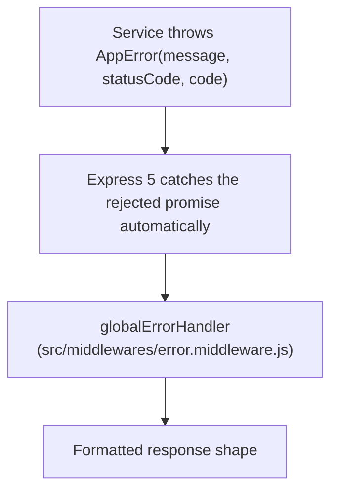

# Error Codes

> **Status:** As-of 2026-06-07. This document is a glossary that drifts as the codebase evolves — refresh it when adding or removing codes from `src/constants/appErrorCode.js`.

The TroveCloud backend returns structured errors with stable, machine-readable codes. The frontend consumes these codes to drive UI behavior (which form to redirect to, which message to show, when to retry). This document is the contract: the source of truth for what each code means and where it's thrown.

---

## 🏗️ How Errors Flow


```mermaid
flowchart TD
    Throw["Service throws AppError(message, statusCode, code)"]
    Catch["Express 5 catches the rejected promise automatically"]
    Handler["globalErrorHandler<br/>(src/middlewares/error.middleware.js)"]
    Response["Formatted response shape"]
    Throw --> Catch --> Handler --> Response
```

Response shape:

```json
{
    "status": "fail | error",
    "error": {
        "code": "PROVIDER_MISMATCH",
        "message": "Human-readable explanation"
    }
}
```

- `status` is `"fail"` for 4xx (client error) and `"error"` for 5xx (server error).
- `code` is one of the values listed in this document, sourced from `src/constants/appErrorCode.js`.
- `message` is human-readable but not stable — frontend code should switch on `code`, never on `message`.

The global handler also auto-converts a few well-known framework errors (Mongoose `ValidationError`, MongoDB `E11000` duplicate-key) into the same shape — see [the conversion table](#-error-codes-from-framework-errors).

---

## 📋 Application Error Codes

Sourced from `src/constants/appErrorCode.js` (an `Object.freeze`-ed enum). Listed alphabetically by code, grouped by domain.

### Authentication

| Code                        | Typical HTTP | Meaning                                                                           | Where thrown                                                                                                                     |
| --------------------------- | ------------ | --------------------------------------------------------------------------------- | -------------------------------------------------------------------------------------------------------------------------------- |
| `ACCOUNT_SUSPENDED`         | 403          | Authenticated user's account has `suspendedAt != null`. Returned for both fresh logins on a suspended account and any existing-session request after suspension; the auth cookie is cleared. | `authenticate` middleware; `loginUser` in `auth.service.js`                                                                       |
| `GITHUB_EMAIL_NOT_VERIFIED` | 400          | GitHub's `/user/emails` response had no entry that was both `primary: true` and `verified: true`. | `verifyGithubCodeAndFetchProfile` in `src/lib/githubAuth.js`                                                                      |
| `GOOGLE_EMAIL_NOT_VERIFIED` | 400          | Google's ID-token payload reported `email_verified: false`.                       | `loginOrCreateGoogleUser` in `auth.service.js`                                                                                   |
| `INVALID_CREDENTIALS`       | 401          | Email not found, or password didn't match.                                        | `loginUser` in `auth.service.js`                                                                                                 |
| `PROVIDER_MISMATCH`         | 400 / 409    | Sign-in or reset attempted with a method that doesn't match the account's stored provider. | `loginUser`, `forgotPassword`, `resetPassword` (400, OAuth user trying password / reset); `loginOrCreateOAuthUser` (409, OAuth attempt collides with non-matching provider) |
| `UNAUTHORIZED_ACCESS`       | 401          | No valid session cookie on a route that requires authentication, or the underlying user has been soft-deleted (`deletedAt != null`). The deleted case is surfaced as a generic unauthorized so account existence is not leaked. | `authenticate` middleware; `loginUser` in `auth.service.js` (soft-deleted account at credential check) |
| `USER_NOT_VERIFIED`         | 400          | Login attempted on an account whose email-OTP was never confirmed.                | `loginUser` in `auth.service.js`                                                                                                 |

### Authorization

Returned by the admin subsystem (`/api/admin/*`). The route gate (`requireRole` / `requireSuperadmin`) and the service-layer hierarchy checks (`assertCanActOn`, `assertNotSelf`) are independent — the service layer remains the durable defense even if route gates are ever relaxed.

| Code                   | Typical HTTP | Meaning                                                                                                                                                          | Where thrown                                                                                            |
| ---------------------- | ------------ | ---------------------------------------------------------------------------------------------------------------------------------------------------------------- | ------------------------------------------------------------------------------------------------------- |
| `CANNOT_ACT_ON_PEER`   | 403          | Caller tried to mutate a user of equal or higher rank (e.g., admin trying to act on another admin, or anyone acting on a superadmin). Fail-closed on unknown roles. | `assertCanActOn` in `src/services/admin/user.service.js` (used by every mutation handler)               |
| `CANNOT_ACT_ON_SELF`   | 403          | Caller tried to apply a destructive admin action to their own account (suspend / change role / soft-delete / hard-delete). Force-logout self is deliberately allowed. | `assertNotSelf` in `src/services/admin/user.service.js`                                                 |
| `INSUFFICIENT_ROLE`    | 403          | Caller's role rank is below the route's minimum (e.g., a `user` hitting `/admin/*`, or an `admin` hitting a superadmin-only mutation route).                       | `requireRole` factory in `src/middlewares/authorize.middleware.js`                                      |
| `LAST_SUPERADMIN`      | 403          | Reserved for a "cannot demote/delete the last superadmin" guard. Defined but currently unused — see [Currently unused codes](#currently-unused-codes).             | (not currently thrown)                                                                                  |

### User

| Code                  | Typical HTTP | Meaning                                                             | Where thrown                                   |
| --------------------- | ------------ | ------------------------------------------------------------------- | ---------------------------------------------- |
| `ACCESS_DENIED`       | 403          | Authenticated user attempted to access a resource they don't own.   | Service layer ownership checks                 |
| `USER_ALREADY_EXISTS` | 409          | Registration attempted with an email that's already verified.       | `createUser`, `resendOTP` in `auth.service.js` |
| `USER_NOT_FOUND`      | 404          | Lookup for a specific user (by email, in OTP / reset flows, or by id in admin actions) failed. | `verifyOTP`, `resendOTP`, `forgotPassword`, `resetPassword` in `auth.service.js`; `getUserById` and `findUserById` (shared by every mutation handler) in `src/services/admin/user.service.js`; `updateProfile` and `uploadProfilePicture` in `src/services/user.service.js` (rare TOCTOU race — user deleted mid-request) |

### File

| Code                 | Typical HTTP | Meaning                                                                                                 | Where thrown                          |
| -------------------- | ------------ | ------------------------------------------------------------------------------------------------------- | ------------------------------------- |
| `FILE_DELETE_FAILED` | 500          | Disk or DB delete failed after the request was authorized.                                              | `deleteFile` in `file.service.js`     |
| `FILE_NOT_FOUND`     | 404          | The requested file doesn't exist or doesn't belong to the user.                                         | `getFile`, `updateFile`, `deleteFile` |
| `FILE_RENAME_FAILED` | 500          | Mongoose update failed after the user passed authorization checks.                                      | `updateFile` in `file.service.js`     |
| `FILE_TOO_LARGE`     | 400          | Upload exceeded the 100 MB per-file cap. Triggered mid-stream by the byte counter; both DB row and partial disk file are rolled back. | `uploadFile` in `file.service.js`     |
| `FILE_UPLOAD_FAILED` | 500          | Stream pipeline to disk failed after the DB row was created — both DB and partial file get rolled back. | `uploadFile` in `file.service.js`     |

### Directory

| Code                      | Typical HTTP | Meaning                                                                                    | Where thrown                                         |
| ------------------------- | ------------ | ------------------------------------------------------------------------------------------ | ---------------------------------------------------- |
| `DIRECTORY_DELETE_FAILED` | 400 / 500    | Attempted to delete the user's root directory (400), or transactional delete failed (500). | `deleteDirectory` in `directory.service.js`          |
| `DIRECTORY_NOT_FOUND`     | 404          | The requested directory doesn't exist or doesn't belong to the user.                       | `getDirectory`, `updateDirectory`, `deleteDirectory` |
| `DIRECTORY_RENAME_FAILED` | 400          | Attempted to rename the user's root directory.                                             | `updateDirectory` in `directory.service.js`          |

### Profile Picture

Returned by the `/api/users/profile-picture` endpoints (authenticated upload/replace + public serve). See [`docs/architecture/profile-picture-upload.md`](../architecture/profile-picture-upload.md) for the full flow.

| Code                        | Typical HTTP | Meaning                                                                                                                                            | Where thrown                                |
| --------------------------- | ------------ | ------------------------------------------------------------------------------------------------------------------------------------------------- | ------------------------------------------- |
| `IMAGE_TOO_LARGE`           | 400          | Upload exceeded the 2 MB profile-picture cap. Tripped mid-stream by the byte counter; the partial file is rolled back.                            | `uploadProfilePicture` in `user.service.js` |
| `INVALID_IMAGE_TYPE`        | 400          | Uploaded bytes weren't a supported raster image. Magic-byte sniff allows JPEG / PNG / WEBP only; SVG and GIF are rejected. Partial file rolled back. | `uploadProfilePicture` in `user.service.js` |
| `PROFILE_PICTURE_NOT_FOUND` | 404          | Serve request had a malformed token (not 32 hex chars) or no file exists for that token. The same code covers both so token validity isn't leaked. | `getProfilePicture` in `user.service.js`    |

### Validation

| Code                  | Typical HTTP | Meaning                                                                          | Where thrown                                                           |
| --------------------- | ------------ | -------------------------------------------------------------------------------- | ---------------------------------------------------------------------- |
| `DUPLICATE_FIELD`     | 409          | MongoDB E11000 duplicate-key error (e.g., trying to register an existing email). | Auto-converted by `globalErrorHandler` from MongoDB E11000             |
| `INVALID_GITHUB_CODE` | 400          | GitHub authorization-code exchange failed. (A missing or non-string `code` is now rejected upstream as `VALIDATION_ERROR`.) | `verifyGithubCodeAndFetchProfile`                |
| `INVALID_ID`          | 400          | Path parameter wasn't a valid Mongo ObjectId.                                    | `validateId` middleware, also auto-converted from Mongoose `CastError` |
| `INVALID_ID_TOKEN`    | 400          | Google ID-token verification failed. (A missing or non-string `idToken` is now rejected upstream as `VALIDATION_ERROR`.)        | `verifyGoogleIdToken`                            |
| `VALIDATION_ERROR`    | 400 / 422    | Request body failed Zod validation at the route (`400`), or Mongoose schema validation failed on `.save()`/`.create()` (`422`, auto-converted).               | `validateBody` middleware (`400`) — wired on the auth routes, the user-profile route (`PATCH /api/users/profile`), and the directory / file-rename / drive-import routes; auto-converted from Mongoose `ValidationError` (`422`) |

### OTP

| Code                | Typical HTTP | Meaning                                                                 | Where thrown                          |
| ------------------- | ------------ | ----------------------------------------------------------------------- | ------------------------------------- |
| `EMAIL_SEND_FAILED` | 500          | Resend API rejected the email (invalid recipient, network error, etc.). | `sendEmail` in `src/lib/sendEmail.js` |
| `INVALID_OTP`       | 400          | Submitted OTP didn't match the stored hash.                             | `verifyOTP`, `resetPassword` in `auth.service.js` |
| `OTP_COOLDOWN`      | 429          | Resend OTP requested within the 60-second cooldown window.              | `resendOTP`, `forgotPassword` in `auth.service.js` |
| `OTP_EXPIRED`       | 400          | Submitted OTP was correct but past its 10-minute lifetime, or the user has no pending OTP. | `verifyOTP`, `resetPassword` in `auth.service.js` |

### General

| Code                  | Typical HTTP | Meaning                                                                                                       | Where thrown                                                       |
| --------------------- | ------------ | ------------------------------------------------------------------------------------------------------------- | ------------------------------------------------------------------ |
| `INTERNAL_ERROR`      | 500          | Catch-all for unexpected errors. Sets `isOperational: false` so the original message is hidden in production. | `globalErrorHandler` fallback when no other handler matches        |
| `INVALID_INPUT`       | 400          | A file-upload filename header couldn't be URL-decoded, or an admin action was rejected because the target's lifecycle state precludes it (e.g., suspending an already-suspended user, restoring a user who is not soft-deleted, unknown role/status filter). _(Directory / file-rename / drive-import body validation now returns `VALIDATION_ERROR` — moved to Zod in PR #44.)_ | `uploadFileHandler` in `file.controller.js` (filename-header decode); state-guard branches across the admin mutation handlers in `src/services/admin/user.service.js` |
| `RATE_LIMITED`        | 429          | Request exceeded a rate limit. Routed through `globalErrorHandler` as the standard envelope; responses also carry `RateLimit-*` headers.                       | The `handler` in `src/middlewares/rateLimit.middleware.js` — the global backstop or any per-tier limiter (auth/oauth/publicRead/read/mutation/destructive/hardDelete/upload/drive) |
| `ROUTE_NOT_FOUND`     | 404          | Requested URL didn't match any registered route.                                                              | 404 handler in `app.js`                                            |

### Drive Import

Returned by `POST /api/drive/import`. Most appear inside the `failed[]` array of the partial-success response rather than as a top-level error — the request itself returns 200 unless input validation fails. See [`docs/architecture/drive-import.md`](../architecture/drive-import.md) for the full flow.

| Code                          | Typical HTTP | Meaning                                                                                              | Where thrown                                                                                |
| ----------------------------- | ------------ | ---------------------------------------------------------------------------------------------------- | ------------------------------------------------------------------------------------------- |
| `DRIVE_EXPORT_TOO_LARGE`      | failed[]     | Drive returned `403 exportSizeLimitExceeded` — Google Docs/Slides over 10 MB cannot be exported.     | `googleDrive.js` shared catch                                                               |
| `DRIVE_IMPORT_FAILED`         | failed[]     | Generic Drive failure — quota, network, JSON parse, or any other unmapped error.                     | `googleDrive.js` and `drive.service.js` per-item catch                                      |
| `DRIVE_IMPORT_LIMIT_EXCEEDED` | failed[]     | Per-file size cap (100 MB) or aggregate cap (500 MB) tripped during streaming.                       | `streamFileIntoTrove` in `drive.service.js` (pre-flight + post-hoc byte counter)            |
| `DRIVE_ITEM_NOT_FOUND`        | failed[]     | Drive returned 404, or the item was trashed when re-fetched.                                         | `googleDrive.js` (404 mapping); `importItem` in `drive.service.js` (trashed check)          |
| `INVALID_DRIVE_TOKEN`         | failed[]     | Drive returned `401` for the access token (expired / invalid) while fetching an item. A missing or malformed `accessToken` body field is now rejected upstream as `VALIDATION_ERROR` (PR #44), so this code only appears per-item in `failed[]`. | `googleDrive.js` (401 mapping), surfaced per-item by `drive.service.js` |
| `UNSUPPORTED_DRIVE_TYPE`      | failed[]     | Picked item is a Shortcut, or a Google-native type without an export mapping (Forms, Drawings, etc.). | `importItem` in `drive.service.js`                                                          |

---

## 🔁 Error Codes from Framework Errors

The global handler maps a few well-known framework error types to clean `AppError`-shaped responses:

| Framework error                         | Mapped to          | HTTP |
| --------------------------------------- | ------------------ | ---- |
| Mongoose `CastError` (invalid ObjectId) | `INVALID_ID`       | 400  |
| Mongoose `ValidationError`              | `VALIDATION_ERROR` | 422  |
| MongoDB E11000 (duplicate key)          | `DUPLICATE_FIELD`  | 409  |
| Anything else (no matching handler)     | `INTERNAL_ERROR`   | 500  |

---

## ➕ Adding a New Error Code

Three-step recipe:

1. **Add the constant** to `src/constants/appErrorCode.js`. Place it under the appropriate domain group (Authentication / User / File / Directory / Validation / OTP / General). Naming is `SCREAMING_SNAKE_CASE` and reads as a noun phrase describing the error condition (`PROVIDER_MISMATCH`, not `MISMATCH_OF_PROVIDER`).
2. **Throw via `AppError`** in the service or middleware that detects the condition:
   ```js
   throw new AppError(
   	"Human-readable message",
   	httpStatus.BAD_REQUEST,
   	NEW_CODE,
   );
   ```
   Pick the HTTP status that best matches the condition — see [HTTP status conventions](#http-status-conventions) below.
3. **Add a row to this document** under the appropriate section.

### HTTP status conventions

- `400` — client sent malformed or invalid data
- `401` — no valid authentication
- `403` — authenticated but not authorized
- `404` — resource genuinely doesn't exist (or user doesn't own it — return 404 not 403, to avoid leaking existence)
- `409` — conflict with current resource state (duplicate email, provider mismatch on OAuth)
- `422` — schema validation failed (semantically distinct from 400 in that the request was well-formed but its content failed business rules)
- `429` — rate-limited (cooldown active)
- `500` — internal failure (DB error, third-party API outage, unhandled case)

### Frontend contract

Frontend code should always switch on `code` to drive UI behavior. Never parse `message` — message strings change between releases without notice; codes are stable.

---

## 📌 Project Context

### Source of truth

`src/constants/appErrorCode.js` — `Object.freeze`-ed export. This document mirrors that file; if they ever drift, the file wins and the document needs updating.

### Naming history

`USER_NOT_FOUND` exists despite there being almost no public endpoint that returns it directly — it's used internally by the OTP and password-reset flows (and, in a rare race, by `PATCH /api/users/profile`). The frontend often won't see this code in normal operation; it's mostly for log diagnostics.

### Currently unused codes

`INVALID_TOKEN` and `TOKEN_EXPIRED` are defined in `appErrorCode.js` but not referenced anywhere today. The global handler previously mapped `JsonWebTokenError` / `TokenExpiredError` to them; that mapping was removed since the project uses session-cookie auth, not JWT. The codes are kept in the enum so they're ready if the project ever migrates to JWT.

`LAST_SUPERADMIN` is defined in `appErrorCode.js` but is not thrown anywhere today. The deployment runs a single-superadmin topology — the only scenarios the guard would catch (demoting or deleting the last superadmin) cannot arise without first creating a second superadmin. Kept in the enum so the guard can be re-added without churning the error contract if topology ever changes.

### Deferred / planned codes

_None currently._ Rate limiting shipped in PR #54 as `RATE_LIMITED` (429) — see the **General** group above. The earlier placeholder name `RATE_LIMIT_EXCEEDED` was not used.

---
