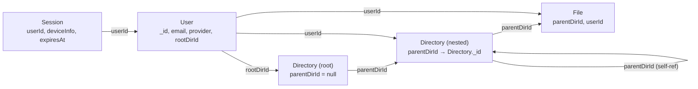

# Database Schema

> **Status:** As-built (2026-04-23). Mirrors `src/models/*` and `src/schemas/*`. Refresh when a model is added, a field is renamed, or an index changes.

The TroveCloud backend runs on MongoDB via Mongoose. This doc is a single place to look up every collection, its fields, its indexes, and how the collections link to each other. The code in `src/models/` is the source of truth — if this document ever drifts from the models, the models win.

---

## 🗺️ Entity Relationship



Four collections total: `users`, `sessions`, `directories`, `files`. Relationships are one-directional `ObjectId` refs. The self-reference on `Directory.parentDirId` is what gives the filesystem its nested tree shape; `null` on `parentDirId` means "this is the user's root".

---

## 📋 Models

### User (`users`)

Source: `src/models/user.model.js`. Atlas mirror: `src/schemas/user.schema.js`.

| Field                   | Type     | Required                  | Default   | Notes                                                         |
| ----------------------- | -------- | ------------------------- | --------- | ------------------------------------------------------------- |
| `name`                  | String   | yes                       | —         | `trim`, `minlength: 3`, `maxlength: 50`                       |
| `email`                 | String   | yes                       | —         | `trim`, `lowercase`, unique index, regex-validated            |
| `password`              | String   | only if `provider=email`  | —         | `minlength: 8`, `select: false`, bcrypt-hashed pre-save       |
| `rootDirId`             | ObjectId | no                        | —         | Set during `verifyOTP` (email path) or OAuth new-user branch  |
| `profilePicture`        | String   | no                        | `null`    | Populated from OAuth profile; nullable in both Mongoose+Atlas |
| `provider`              | String   | yes                       | `"email"` | Enum `["email", "google", "github"]`. Immutable via pre-save  |
| `otp`                   | String   | no                        | —         | `select: false`, hashed                                       |
| `otpExpiresAt`          | Date     | no                        | —         | `select: false`                                               |
| `isVerified`            | Boolean  | no                        | `false`   | Flips to `true` inside `verifyOTP` transaction                |
| `verificationExpiresAt` | Date     | no                        | —         | `select: false`, TTL-indexed                                  |
| `createdAt`/`updatedAt` | Date     | —                         | —         | Via `timestamps: true`                                        |

**Indexes**

- `email` — unique (from `unique: true` on schema).
- `verificationExpiresAt` — TTL (`expireAfterSeconds: 0`). Deletes unverified users automatically when their 1-hour verification window expires.

**Hooks**

- `pre("save")` — bcrypt-hashes `password` when dirty (`isModified("password")`).
- `pre("save")` — throws if `provider` is directly modified on a non-new document. This replaces the removed `immutable: true` flag; see `transaction-patterns.md` and the commit history for why (Mongoose 9 `applyDefaults` interaction with `strict: "throw"`).

**Instance methods**

- `comparePassword(plaintext)` — bcrypt-compare against the stored hash. Callers must query with `.select("+password")` first.

---

### Session (`sessions`)

Source: `src/models/session.model.js`. No Atlas `$jsonSchema` validator is registered — sessions are high-churn and the collection is effectively append + TTL.

| Field                  | Type     | Required | Default            | Notes                                            |
| ---------------------- | -------- | -------- | ------------------ | ------------------------------------------------ |
| `userId`               | ObjectId | yes      | —                  | Owning user                                      |
| `deviceInfo.userAgent` | String   | no       | —                  | Raw UA string                                    |
| `deviceInfo.ipAddress` | String   | no       | —                  | From `req.ip`                                    |
| `deviceInfo.deviceType`| String   | no       | —                  | Parsed via `ua-parser-js`                        |
| `deviceInfo.browser`   | String   | no       | —                  | Parsed via `ua-parser-js`                        |
| `deviceInfo.deviceOS`  | String   | no       | —                  | Parsed via `ua-parser-js`                        |
| `createdAt`            | Date     | yes      | `Date.now`         | Explicit default (not from `timestamps`)         |
| `expiresAt`            | Date     | yes      | `sevenDaysFromNow` | Controls the TTL; overrideable per-session       |

No `updatedAt` — sessions are immutable once issued.

**Indexes**

- `expiresAt` — TTL (`expireAfterSeconds: 0`). MongoDB reaps expired sessions automatically so the logout path doesn't have to.

---

### Directory (`directories`)

Source: `src/models/directory.model.js`. Atlas mirror: `src/schemas/directories.schema.js`.

| Field                   | Type     | Required | Default | Notes                                         |
| ----------------------- | -------- | -------- | ------- | --------------------------------------------- |
| `name`                  | String   | yes      | —       | `trim`, `minlength: 3`, `maxlength: 50`       |
| `parentDirId`           | ObjectId | no       | `null`  | `null` means this document is a user's root   |
| `userId`                | ObjectId | yes      | —       | Owning user                                   |
| `createdAt`/`updatedAt` | Date     | —        | —       | Via `timestamps: true`                        |

**Indexes**

- Compound `{ parentDirId: 1, userId: 1 }` — supports "list children of dir X belonging to user Y", which is the hot path for the directory listing UI.

**Self-reference**

`parentDirId` points at another `Directory._id` — or `null` for the root. Recursive listing uses MongoDB's `$graphLookup` with a max depth of 20.

---

### File (`files`)

Source: `src/models/file.model.js`. Atlas mirror: `src/schemas/files.schema.js`.

| Field                   | Type     | Required | Default | Notes                                           |
| ----------------------- | -------- | -------- | ------- | ----------------------------------------------- |
| `name`                  | String   | yes      | —       | `trim`, `minlength: 3`. No max enforced yet     |
| `extension`             | String   | yes      | —       | `trim`, `lowercase`. Stored separately          |
| `parentDirId`           | ObjectId | yes      | —       | The containing directory                        |
| `userId`                | ObjectId | yes      | —       | Owning user (denormalized for cheap auth)       |
| `createdAt`/`updatedAt` | Date     | —        | —       | Via `timestamps: true`                          |

**Indexes**

- Compound `{ parentDirId: 1, userId: 1 }` — mirrors the Directory index; lets "list files in dir X owned by user Y" hit a single index.

**Name vs extension**

The name and extension are stored in separate fields so renames don't accidentally change the file type (the controller layer re-attaches the original extension during update). There's no uniqueness constraint — two files with the same `name + extension` in the same directory are allowed today; dedup lives in the UI if the user wants it.

---

## 🔒 Hidden Fields Convention

Sensitive fields are hardcoded with `select: false` at the schema level. The defaults:

| Model | Hidden fields                                           |
| ----- | ------------------------------------------------------- |
| User  | `password`, `otp`, `otpExpiresAt`, `verificationExpiresAt` |

Queries don't return these unless explicitly re-selected via `.select("+fieldName")`. That override lives **in the service layer only** — never controllers, never middleware. Two call sites today:

- `loginUser` — `.select("+password")` to run bcrypt-compare.
- `verifyOTP` / `resendOTP` — `.select("+otp +otpExpiresAt +verificationExpiresAt")` to validate against the stored OTP hash.

This pattern is documented in `CLAUDE.md §7` as "Security by Default". Adding a new sensitive field means adding `select: false` at the schema level, not relying on service-layer discipline.

---

## ⏱️ TTL Indexes

Two TTL indexes keep the database self-cleaning. Both use `expireAfterSeconds: 0`, which tells MongoDB "delete this document as soon as the indexed date field is in the past".

| Collection | Field                   | Lifetime  | Purpose                                            |
| ---------- | ----------------------- | --------- | -------------------------------------------------- |
| `users`    | `verificationExpiresAt` | 1 hour    | Drop unverified registrations automatically       |
| `sessions` | `expiresAt`             | 7 days    | Expire stale login sessions without explicit logout |

MongoDB's TTL monitor runs every 60 seconds, so there's up to a one-minute lag between the timestamp lapsing and the document actually disappearing. Fine for both use cases.

The User TTL is cleared on successful verification — `verifyOTP` sets `user.verificationExpiresAt = undefined` before saving, which removes the field entirely. Once the field is gone, the TTL index stops tracking the document.

---

## 🔗 Cross-Model Relationships

The refs in one place:

- `Session.userId` → `User._id` — a user can have up to 5 active sessions; enforced in `enforceDeviceLimit`.
- `User.rootDirId` → `Directory._id` — one-way pointer set atomically during `verifyOTP` / OAuth new-user. See `transaction-patterns.md` for why User+Directory are co-created in a transaction.
- `Directory.parentDirId` → `Directory._id` (self) or `null` — the tree structure.
- `Directory.userId` → `User._id` — denormalized ownership for cheap auth checks (avoids walking up to the root).
- `File.parentDirId` → `Directory._id` — required; a file cannot orphan.
- `File.userId` → `User._id` — same denormalization rationale as Directory.

**Cascading deletes** are handled by `directory.service.js`'s recursive delete: it walks the tree via `$graphLookup`, deletes directory + file rows inside a transaction, and cleans up physical files with `Promise.allSettled` outside. See `transaction-patterns.md` for the "not-retry-safe work stays out" rule.

---

## 🌐 Atlas `$jsonSchema` Mirror

Three collections (`users`, `directories`, `files`) have Atlas-side `$jsonSchema` validators under `src/schemas/`. They enforce the same constraints as the Mongoose schema at the database level — so a direct `mongosh` write that bypasses Mongoose still can't insert an invalid document.

**The mirror has to track the Mongoose schema exactly.** We learned this the hard way during the OAuth rollout: Mongoose had `profilePicture: { default: null }`, but Atlas required `bsonType: "string"`. OAuth inserts failed with `Document failed validation` until the Atlas validator was widened to `bsonType: ["string", "null"]`. Any schema change must be applied to both files.

The `sessions` collection has no Atlas validator — session writes happen exclusively through Mongoose, and the collection churn is high enough that the extra validation pass didn't earn its keep.

To apply validators after editing any schema under `src/schemas/`:

```bash
node src/schemas/validateSchema.js
```

This runs `collMod` against each collection with `validationLevel: "strict"` and `validationAction: "error"`.

---

## 🚧 Non-Goals

- **Soft delete.** No `deletedAt` field on any collection. Deletes are physical. If soft-delete becomes a requirement, it's a cross-cutting change touching every query filter in the service layer.
- **Optimistic concurrency control beyond Mongoose defaults.** Concurrent writes to the same document land last-write-wins. `__v` is present (default Mongoose behavior) but not actively enforced.
- **Schema versioning.** Field renames are not supported in place; they'd need a dual-write migration. Additions-with-defaults are safe.
- **Full-text search indexes.** No `$text` or Atlas Search indexes. Listing queries are direct field lookups only.

---

## 📌 Project Context

### Source of truth

- `src/models/*.js` — Mongoose schemas, hooks, instance methods. **Authoritative.**
- `src/schemas/*.js` — Atlas `$jsonSchema` mirrors. Must track the Mongoose side exactly.
- `src/schemas/validateSchema.js` — the runner that pushes validators to Atlas via `collMod`.

### When to add a new collection

If a new feature needs a new collection:

1. Create `src/models/<name>.model.js` with the schema, hooks, and indexes.
2. If business-critical or user-facing, add `src/schemas/<name>.schema.js` with the `$jsonSchema` mirror.
3. Register the new schema in the `collections` array in `validateSchema.js`.
4. Run `node src/schemas/validateSchema.js` against the target Atlas cluster.
5. Update this document with the new row in the ERD and a model section.

### Deferred work

- No per-user storage cap — tracked against the Drive import feature (see `drive-import.md`).
- No HTML escaping of user-supplied fields when they end up in email templates — tracked in `email-template-system.md` non-goals.
- Session documents don't have an Atlas validator; revisit if session-write bugs start shipping past tests.

---
