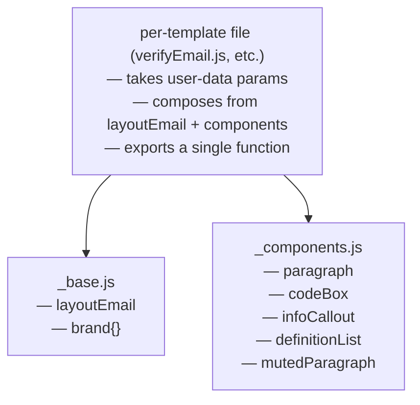
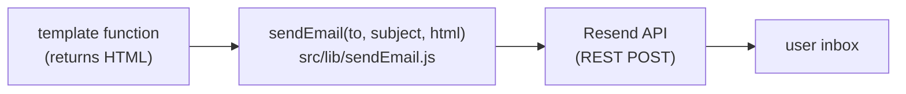

# Email Template System

> **Status:** As-built (2026-04-30). Reflects the structure introduced in PR #18 and the password-reset wiring added in PR #25.

Describes how transactional emails (OTP verification, password reset, security alerts, etc.) are composed and dispatched. Read this before adding a new email template, or when curious why a particular styling choice was made.

---

## 🏗️ Composition Model

Templates are plain JavaScript functions that return HTML strings. Composition is layered, not framework-driven:



Templates compose by calling component functions inside template literals. There's no JSX, no MJML, no build step — each template file produces an HTML string at runtime that gets passed straight to the Resend dispatcher.

---

## 🧭 Design Decisions

- **Plain template literals over a templating library.** No Handlebars, EJS, MJML, or react-email. The justification: ~5–10 templates, single developer, no design team, no need for cross-client polish beyond what hand-written tables + inline styles provide. Adding a library would be ~40 KB of dependencies and a build step for marginal gain. If the project ever needs Outlook 2007 polish or designer-editable templates, MJML is the documented graduation path (see `_components.js` comments and the deferred-work memory).
- **Light theme for emails, even though the app is dark-mode-only.** The app's TroveCloud-style-guide is dark; emails are intentionally light (white card on near-white page). Email clients have inconsistent dark-mode support, automatically invert colors in unpredictable ways on dark backgrounds, and dark-themed emails are uncommon in inboxes — they read as out-of-place. The brand purple `#7C3AED` is used **only in the wordmark** as a single accent connecting the email visually to the app brand.
- **Table-based layout, inline styles only.** No `<style>` blocks (many clients strip them), no flexbox / grid, no CSS variables. Tables and inline styles are the lowest-common-denominator that renders consistently across Gmail, Outlook, Apple Mail, iOS Mail, Android Gmail, and Yahoo.
- **No Google Fonts or web fonts.** Most email clients won't load them anyway. Fall back to a system font stack: `-apple-system, BlinkMacSystemFont, 'Segoe UI', Roboto, Helvetica, Arial, sans-serif`.
- **Hosted brand assets, not embedded.** The logo is an `` (Cloudflare R2). Base64 inline images get stripped by Gmail and inflate email size; SVG isn't reliably supported in Outlook 2007–2016. Hosted PNG with `alt="TroveCloud"` is the most compatible choice.

---

## 🎨 Brand Tokens

All visual styling references the `brand` object exported from `_base.js`:

| Token          | Value             | Purpose                                               |
| -------------- | ----------------- | ----------------------------------------------------- |
| `name`         | `"TroveCloud"`    | The brand wordmark text                               |
| `primaryColor` | `#7C3AED`         | Wordmark color only (one accent borrowed from app UI) |
| `logoUrl`      | Cloudflare R2 URL | The 48×48 logo `` in the header                  |
| `textColor`    | `#111827`         | Body copy                                             |
| `mutedColor`   | `#6b7280`         | Footer text, captions                                 |
| `bgColor`      | `#f9fafb`         | Page background (around the card)                     |
| `cardBg`       | `#ffffff`         | The content card background                           |
| `borderColor`  | `#e5e7eb`         | Card border, dividers                                 |
| `alertBg`      | `#fff7ed`         | Amber callout background                              |
| `alertBorder`  | `#f59e0b`         | Amber callout left border                             |
| `alertText`    | `#7c2d12`         | Amber callout body text                               |

The token object is `Object.freeze`-ed to prevent accidental mutation at runtime.

---

## 📝 Template Anatomy

Every template file follows the same shape:

```js
//* src/templates/emails/<name>.js

import { layoutEmail } from "./_base.js";
import { paragraph, codeBox, infoCallout } from "./_components.js";

const TEMPLATE_NAME = (...userData) =>
	layoutEmail({
		preheader: "Inbox-preview text shown next to the subject",
		title: "Browser tab title",
		bodyHtml: `
            <h1 style="...">Heading</h1>
            ${paragraph(`Hi ${userData.name},`)}
            ${paragraph("Body copy describing what just happened or what to do next.")}
            ${codeBox(userData.code)}
            ${infoCallout("Security note about expiry / what to do if this wasn't them.")}
        `,
	});

export { TEMPLATE_NAME };
```

Three required pieces in `layoutEmail({...})`:

- **`preheader`** — short string shown in the inbox list as preview text after the subject. Hidden inside the open email via the `display: none` span in `_base.js`. Always include something useful — if absent, clients fall back to whatever the first visible text in the body happens to be (often the brand wordmark, which is uninformative).
- **`title`** — the HTML `<title>` element. Some clients show it in tab/notification UI.
- **`bodyHtml`** — the actual content card. Composed from component functions.

---

## ✉️ Sending Pipeline



The dispatcher (`src/lib/sendEmail.js`) is a thin wrapper around the Resend SDK with a try/catch that maps any failure to `EMAIL_SEND_FAILED` and an `AppError`. Templates are called by services (e.g., `otp.service.js`'s `sendOTP` calls `VERIFY_EMAIL_TEMPLATE` and passes the result to `sendEmail`).

The separation is intentional: templates know only about HTML, the dispatcher knows only about delivery. Neither knows about the business logic that triggered the email.

---

## 🧱 File Layout

```
src/templates/emails/
├── _base.js            # brand tokens + layoutEmail wrapper
├── _components.js      # paragraph, mutedParagraph, codeBox,
│                       #   infoCallout, definitionList
├── verifyEmail.js      # VERIFY_EMAIL_TEMPLATE
├── passwordReset.js    # PASSWORD_RESET_EMAIL_TEMPLATE
├── newDeviceAlert.js   # NEW_DEVICE_ALERT_EMAIL_TEMPLATE
└── index.js            # barrel re-exports
```

The `_` prefix on `_base.js` and `_components.js` signals "internal building blocks" — they're imported by other files in the folder, not by services or controllers directly.

The barrel `index.js` re-exports every template so callers can do:

```js
import { VERIFY_EMAIL_TEMPLATE } from "../templates/emails/index.js";
```

instead of importing from individual files.

---

## ➕ Adding a New Template

Five-step recipe:

1. **Create the file:** `src/templates/emails/<name>.js`. Export a single function that takes domain data and returns HTML.
2. **Compose using existing primitives.** Import `layoutEmail` from `_base.js`, plus whichever components you need from `_components.js`. If you need a new visual primitive (e.g., a "primaryButton"), add it to `_components.js` first — don't inline new visual patterns in the template file.
3. **Re-export from `index.js`.** Add a single `export { ... } from "./<name>.js"` line so callers can import via the barrel.
4. **Wire into a service.** Find or write the service function that needs to send this email. Import the template + `sendEmail`, call `sendEmail(toAddress, subject, TEMPLATE(args))`.
5. **Test render once.** Run the template function in isolation (e.g., `node -e "import('./src/templates/emails/index.js').then(m => console.log(m.NEW_TEMPLATE('Test')))"`) and paste the output into a browser to eyeball before sending real email.

### Choosing what's a component vs what's per-template

If a visual element appears in **two or more templates**, extract it to `_components.js`. If it's a one-off, keep it inline in the template file. The current set of components was extracted because each appears in multiple templates: `paragraph` (every template), `codeBox` (verify + password reset), `infoCallout` (every template), `definitionList` (new-device alert; would also fit a future "subscription details" email), `mutedParagraph` (footer-style notes).

---

## ⚠️ Email-Client Compatibility Notes

Patterns that work everywhere, and gotchas worth knowing:

- **Tables for layout.** All structural layout uses `<table role="presentation" cellspacing="0" cellpadding="0" border="0">`. The `role="presentation"` is for screen readers (tells them the table is layout, not data). Don't use flexbox or grid.
- **Inline styles only.** Most email clients strip `<style>` blocks in `<head>`. Every styling rule lives on the element via the `style="..."` attribute.
- **Always include `width` and `height` attributes on ``.** Outlook needs them as HTML attributes, not just CSS. Always include `alt="..."` so the email reads sensibly when images are blocked (Gmail blocks images by default until the user clicks "Display images below").
- **Preheader span needs multiple hiding tricks.** The hidden preheader uses `display: none; font-size: 1px; max-height: 0; opacity: 0; overflow: hidden;`. Different clients respect different properties — using all of them is the industry-standard belt-and-suspenders.
- **Avoid background images.** Many clients strip them. Use solid colors for backgrounds.
- **Buttons render unreliably.** If a future template needs a CTA button, render it as a styled `<a>` inside a centered `<div>`, never as `<button>`. (The template system already includes a `primaryButton` component pattern for this — see git history of PR #18 for the temporary version, removed when the OTP-based password reset replaced the link-based one.)
- **Dark-mode auto-inversion.** Some clients (Apple Mail in dark mode, Outlook) auto-invert white backgrounds. The current light theme is robust to this. If you ever ship a dark-themed email, test in multiple clients first.

---

## 🚧 Non-Goals

- **No template engine.** Plain template literals only. Adding Handlebars / EJS would solve a problem we don't have (designer-editable templates, dynamic logic in markup).
- **No MJML or component framework.** Same reason — overkill for the current template count. Documented as the graduation path if email-client polish ever becomes an active concern.
- **No localization / i18n.** All templates are English. If multi-locale ever becomes a requirement, it would be a substantial cross-cutting change touching every template.
- **No HTML escaping of interpolated user data.** A known concern: `userName` and provider-supplied fields like `deviceInfo.browser` are interpolated directly into the HTML. Self-XSS for verify / password-reset (the email goes to the user's own inbox); a real XSS vector for new-device-alert when wired up. Tracked as a follow-up — adding an `escapeHtml(s)` helper to `_components.js` is straightforward.

---

## 📌 Project Context

### Active templates

| Template                          | Wired? | Call site                                                                                  |
| --------------------------------- | ------ | ------------------------------------------------------------------------------------------ |
| `VERIFY_EMAIL_TEMPLATE`           | ✅     | `otp.service.js` `sendOTP` (register, resend)                                              |
| `PASSWORD_RESET_EMAIL_TEMPLATE`   | ✅     | `otp.service.js` `sendPasswordResetOTP` (forgot-password, since PR #25)                    |
| `NEW_DEVICE_ALERT_EMAIL_TEMPLATE` | ⏳     | No call site yet — awaits new-device detection in `enforceDeviceLimit` or session creation |

### Required env vars (consumed by `sendEmail.js`, not the templates)

- `RESEND_API_KEY`
- `EMAIL_FROM` — the From address shown to recipients

### Logo URL

Hardcoded in `_base.js` `brand.logoUrl` as `https://assets.trovecloud.app/email/logo.png` (Cloudflare R2 bucket). If the bucket URL changes, this is a one-line edit. Consider moving to `envConfig` if multiple environments need different logos.

### Deferred work tracked in memory

- HTML escaping of user-supplied interpolations.
- Wiring up `NEW_DEVICE_ALERT_EMAIL_TEMPLATE` (needs new-device detection logic in the session-creation path).

---
