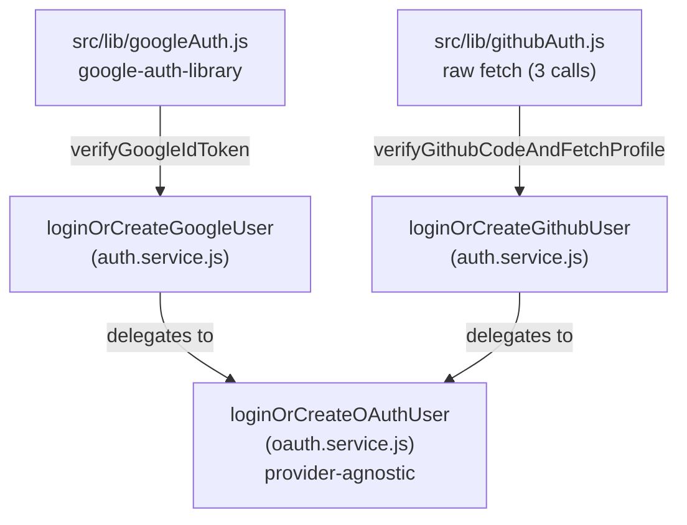

# Multi-Provider OAuth

> **Status:** As-built (2026-04-23). Reflects the architecture in place after PR #14 (shared OAuth helper) and PR #13 (GitHub OAuth).

Describes the cross-cutting design that powers Google and GitHub sign-in. For per-flow user-journey detail (request shape, response shape, redirect mechanics), see [`docs/authentication/login-and-sessions.md`](../authentication/login-and-sessions.md). This document is for understanding the _shape_ of the system — how a third provider would slot in, where the security guards live, why tokens aren't stored.

---

## 🏗️ Architecture Overview

Each OAuth provider has a **thin provider-specific function** in `auth.service.js` that handles the provider's idiosyncratic verification step (verifying a Google ID token, or exchanging a GitHub code for an access token + fetching profile). After producing a normalized profile (`{ name, email, picture }`), the function delegates to a single **provider-agnostic helper** that runs the find-or-create user logic, applies security guards, refreshes the profile, enforces device caps, and issues a session.

The split keeps provider-specific code small and predictable, while concentrating the security-critical logic (account-takeover guards, transaction scope, device-cap enforcement) in one place.



---

## 🧭 Design Decisions

- **No token storage.** Access tokens (and the absent refresh tokens) live only in request memory. The User schema has no `accessToken`, `refreshToken`, or `tokenExpiresAt` fields. Sign-in is one-shot — the provider proves identity, the backend issues a session cookie, and the provider's token is discarded.
- **Scope: sign-in only.** Google requests minimal `openid email profile` (implicit via the ID token flow). GitHub requests `read:user user:email`. Neither scope grants resource access; the backend never reads your Drive, gist, repo list, etc.
- **Provider clients use raw `fetch`.** Both `src/lib/googleAuth.js` and `src/lib/githubAuth.js` avoid SDKs (`googleapis`, `@octokit/oauth-app`). The Google ID-token verification uses `google-auth-library` because cryptographic JWT verification needs proper key-rotation support; everything else (GitHub's three-step handshake, Drive imports if added later) uses `fetch` directly. Keeps dependency weight down and the wire-level behavior visible.
- **Frontend owns the OAuth dance.** The frontend uses Google Identity Services and GitHub's OAuth redirect flow to obtain the ID token (Google) or authorization code (GitHub), then POSTs that token/code to the backend. The backend never exchanges authorization codes for Google (ID tokens are self-verifiable), and exchanges GitHub codes via a single POST. No `*_CALLBACK_URL` env vars on the backend — the callback URL belongs to the frontend.

---

## 🛡️ Security Guards

Three guards run on every OAuth sign-in. All three live in code, none rely on schema-level enforcement alone.

### 1. Email-verified gate (per-provider)

The provider's verification step must report that the user's email is verified by the provider:

- **Google:** the ID token payload includes `email_verified: true`. Falsy → reject with `GOOGLE_EMAIL_NOT_VERIFIED`.
- **GitHub:** the `/user/emails` response must contain an entry where `primary: true && verified: true`. Otherwise reject with `GITHUB_EMAIL_NOT_VERIFIED`.

Without this gate, an attacker could register an email they don't actually own and pass it through the provider.

### 2. Account-takeover provider mismatch (in `loginOrCreateOAuthUser`)

When an existing user is found by email but registered with a different provider:

```js
if (existingUser.provider !== provider) {
    throw new AppError(..., CONFLICT, PROVIDER_MISMATCH);
}
```

This blocks the most subtle attack vector in multi-provider auth: a malicious actor with a Google identity tied to an email address that's already a password-registered account in TroveCloud cannot silently take over by signing in via Google.

### 3. Password-login provider mismatch (in `loginUser`)

When a user with a non-`email` provider attempts password sign-in:

```js
if (user.provider !== "email") {
    throw new AppError(`Please sign in with ${user.provider}`, ..., PROVIDER_MISMATCH);
}
```

This runs **before** `bcrypt.compare()` — OAuth users have no password hash, so bcrypt would throw an internal error instead of cleanly rejecting. The guard provides the clean rejection.

### Bonus: pre-save hook on `provider` field

The `provider` field on the User model is enforced as effectively-immutable via a pre-save hook in `user.model.js` that uses `isDirectModified('provider')`:

```js
userSchema.pre("save", async function () {
	if (!this.isNew && this.isDirectModified("provider")) {
		throw new Error("Path `provider` cannot be changed after creation");
	}
});
```

The naive approach (`immutable: true` at the schema level) trips a Mongoose 9 false-positive — see `docs/architecture/transaction-patterns.md` and the project memory for the full diagnosis.

---

## 🛣️ Provider Endpoints

Both endpoints accept a single field carrying the provider's verification artifact, return the same `{ session, isNewUser }` shape internally, and set the same session cookie externally.

| Endpoint                | Field     | Verifier                          | Library               |
| ----------------------- | --------- | --------------------------------- | --------------------- |
| `POST /api/auth/google` | `idToken` | `verifyGoogleIdToken`             | `google-auth-library` |
| `POST /api/auth/github` | `code`    | `verifyGithubCodeAndFetchProfile` | raw `fetch`           |

Response is `201 Created` when the call provisioned a new account, `200 OK` when an existing user signed in. See [`login-and-sessions.md`](../authentication/login-and-sessions.md) for full request/response shapes.

---

## 🔄 The Shared Flow

`loginOrCreateOAuthUser(provider, profile, deviceInfo)` in `src/services/oauth.service.js`:

1. **User lookup.** `User.findOne({ email }).lean()`.
2. **Existing-user path:**
   - Run the account-takeover provider-mismatch guard.
   - Diff-then-update the denormalized profile fields (`name`, `profilePicture`) only when the provider's payload differs from stored values. Single `User.updateOne` with `runValidators: true`.
   - Enforce `MAX_ALLOWED_DEVICES` via `enforceDeviceLimit(userId)` (shared with the password login path; see `src/services/session.service.js`).
   - Create a `Session` and return `{ session, isNewUser: false }`.
3. **New-user path:**
   - Open a MongoDB transaction.
   - Inside: `User.create([...])` with `provider`, `isVerified: true`, no password, `profilePicture` from payload. Then `Directory.create([...])` for the root directory.
   - Close transaction.
   - **Outside the transaction:** create the Session. (See `transaction-patterns.md` for why this is outside.)
   - Return `{ session, isNewUser: true }`.

---

## 🧱 File Layout

```
src/
├── lib/
│   ├── googleAuth.js            # verifyGoogleIdToken (google-auth-library wrapper)
│   └── githubAuth.js            # verifyGithubCodeAndFetchProfile (raw fetch, 3 calls)
├── services/
│   ├── auth.service.js          # loginOrCreateGoogleUser + loginOrCreateGithubUser (thin)
│   ├── oauth.service.js         # loginOrCreateOAuthUser (shared, provider-agnostic)
│   └── session.service.js       # enforceDeviceLimit (shared with password path)
├── controllers/
│   └── auth.controller.js       # googleOAuthHandler + githubOAuthHandler
└── routes/
    └── auth.routes.js           # POST /google, POST /github
```

The `lib/` files are **provider-specific transport** — they know the wire format for their provider. The `services/` files are **business logic** — they don't care which provider produced the profile.

---

## 🧩 Provider-Specific Differences

What the `lib/` wrappers actually do, side by side. Split into three smaller tables so each column has room to breathe.

### Verification mechanism

| Aspect               | Google                                          | GitHub                                                                |
| -------------------- | ----------------------------------------------- | --------------------------------------------------------------------- |
| Frontend supplies    | ID token (JWT)                                  | Authorization code (single-use, short-lived)                          |
| Backend verifies via | Cryptographic verification of the JWT signature | POST to GitHub's `oauth/access_token` to exchange code → access token |
| Calls to provider    | None (offline JWT verification)                 | 3: token exchange, `GET /user`, `GET /user/emails`                    |

### Profile fields

| Aspect               | Google                                       | GitHub                                                                         |
| -------------------- | -------------------------------------------- | ------------------------------------------------------------------------------ |
| Email source         | `payload.email` (always present in ID token) | `/user/emails` (because `/user.email` may be `null` if user hid it)            |
| Email-verified field | `payload.email_verified` (boolean)           | `email.primary && email.verified` on the email entry                           |
| Display name         | `payload.name`                               | `userData.name` with `userData.login` fallback (name is nullable on GitHub)    |
| Avatar URL           | `payload.picture`                            | `userData.avatar_url`                                                          |

### Hardening

| Aspect              | Google                                  | GitHub                                                                  |
| ------------------- | --------------------------------------- | ----------------------------------------------------------------------- |
| Timeout / hardening | Library-managed                         | `AbortSignal.timeout(8000)` per call, explicit `User-Agent`             |
| Catch behavior      | Wraps any failure as `INVALID_ID_TOKEN` | Re-throws AppError instances; wraps unexpected as `INVALID_GITHUB_CODE` |

---

## ➕ Adding a Third Provider

Recipe for a hypothetical Microsoft / Apple / Discord OAuth, in order:

1. **Add the provider value to the `User.provider` enum** in both `src/models/user.model.js` and `src/schemas/user.schema.js` (Atlas validator).
2. **Write the lib wrapper:** `src/lib/<provider>Auth.js` that produces a normalized `{ name, email, picture }` from whatever the provider's flow produces. Include the email-verified gate inside the wrapper if the provider's API design naturally couples it to the profile fetch (GitHub does this; Google's ID token lets it live in the service layer).
3. **Add a thin function to `auth.service.js`:** `loginOrCreate<Provider>User(input, deviceInfo)` that calls the lib, applies any provider-only guards, and delegates to `loginOrCreateOAuthUser(<provider>, profile, deviceInfo)`.
4. **Add a controller handler and route:** `<provider>OAuthHandler` in `auth.controller.js`, `POST /api/auth/<provider>` in `auth.routes.js`.
5. **Add error codes** to `src/constants/appErrorCode.js` (e.g., `INVALID_<PROVIDER>_CODE`, `<PROVIDER>_EMAIL_NOT_VERIFIED`).
6. **Update the Identity Providers table** in `docs/authentication/login-and-sessions.md` from "reserved" to active.
7. **Add env vars** if the provider needs a client ID / secret on the backend (Google needs `GOOGLE_CLIENT_ID`; GitHub needs both `GITHUB_CLIENT_ID` + `GITHUB_CLIENT_SECRET`).

The `loginOrCreateOAuthUser` helper requires zero changes — it's already provider-agnostic.

---

## 🧰 Reuse Map

| What's reused                           | Existing function               | Location                             |
| --------------------------------------- | ------------------------------- | ------------------------------------ |
| Find-or-create user + session issuance  | `loginOrCreateOAuthUser`        | `src/services/oauth.service.js`      |
| Device-cap eviction                     | `enforceDeviceLimit(userId)`    | `src/services/session.service.js`    |
| Session-cookie issuance                 | `setAuthCookie(res, sessionId)` | `src/utils/cookies.js`               |
| Device metadata extraction from request | `buildDeviceInfo(req)`          | `src/utils/deviceInfo.js`            |
| Atomic User + Directory provisioning    | `withTransaction` pattern       | `src/services/oauth.service.js`      |
| Auth middleware on protected routes     | `authenticate`                  | `src/middlewares/auth.middleware.js` |

---

## 🚧 Non-Goals

These are deliberately not implemented. Each represents a future feature, not an oversight.

- **Account linking.** A password-registered user cannot currently link a Google identity (or vice versa). The `provider` field is single-valued and immutable. Linking would require either a multi-valued `providers` array on the User schema or a separate `LinkedProvider` collection.
- **Refresh tokens / persistent provider sessions.** No refresh token storage. If a feature later needs ongoing access to the provider's APIs (e.g., periodic Drive sync), it would add per-user token storage as a separate concern.
- **Provider-managed profile data beyond name/email/picture.** Phone number, locale, organizational affiliation, etc. — none are stored even when the provider exposes them.
- **OAuth scope expansion at sign-in.** Both providers stay at minimal sign-in scopes. Scope-expansion flows (e.g., "let me read your Drive files") would be a separate user-initiated action, not bundled into sign-in.
- **Rate limiting on `/auth/google` and `/auth/github`.** Tracked separately for the security-section work.

---

## ✅ Verification

Quick smoke tests when working on this area:

- **Sign in with Google as a brand-new user** → 201; User and root Directory created; `provider: "google"`, `isVerified: true`, no password.
- **Sign in with Google as the same user again** → 200; new session; profile fields refreshed only if Google returned different name/picture.
- **Sign in with GitHub using an account whose email matches a Google-provisioned user** → 409 `PROVIDER_MISMATCH`.
- **Sign in with email/password using an email that's actually a Google account** → 400 `PROVIDER_MISMATCH`.
- **POST `/api/auth/google` with no body** → 400 `INVALID_ID_TOKEN`.
- **POST `/api/auth/github` with `code: {}` (object)** → 400 `INVALID_GITHUB_CODE` (currently relies on truthy check; type-check is deferred).

---

## 📌 Project Context

### Active providers

| Provider | Endpoint                | Lib                     | Wired into frontend?               |
| -------- | ----------------------- | ----------------------- | ---------------------------------- |
| Google   | `POST /api/auth/google` | `src/lib/googleAuth.js` | Backend ready, frontend UI pending |
| GitHub   | `POST /api/auth/github` | `src/lib/githubAuth.js` | Backend ready, frontend UI pending |

### Required env vars

- `GOOGLE_CLIENT_ID` — used to verify Google ID-token audience.
- `GITHUB_CLIENT_ID` and `GITHUB_CLIENT_SECRET` — used in the GitHub code-exchange POST.

No `*_CALLBACK_URL` on the backend — the frontend owns OAuth redirect URLs.

### Deferred work tracked in memory

- OAuth body type-checking (currently truthy-only) → covered when backend Zod validation lands.
- Rate limiting on the OAuth endpoints → covered during the Node.js course security section.
- Account linking → no concrete plan; would require schema changes.

---
